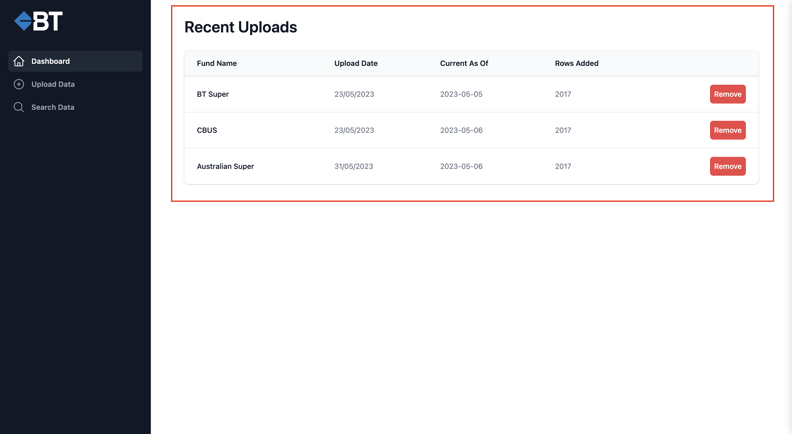

# BT Financial 4Data Application

## Getting Started

To run this example, simply do:

```sh
npm install
npm run dev
```

Open [http://localhost:3000](http://localhost:3000) with your browser to see the result.

## Deploy on Vercel

The easiest way to deploy your Next.js app is to use the [Vercel Platform](https://vercel.com/new?utm_medium=default-template&filter=next.js&utm_source=create-next-app&utm_campaign=create-next-app-readme) from the creators of Next.js.

Check out our [Next.js deployment documentation](https://nextjs.org/docs/deployment) for more details.

## Using the App

### Recent Uploads

This table shows uploads to the application



Upon clicking the remove button it will delete the whole entry uploaded to the database

### Add Data

A user picks a super fund (List of funds managed in Supabase database)


### Search Data

Search based on column name


